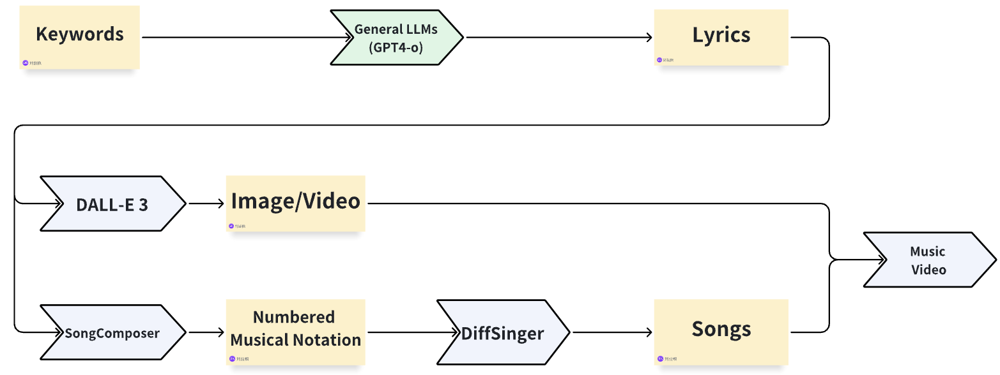

# Music Dream Visualizer (MDV)
## Introduction
Welcome to music dream visualizer! This is a LLM course project built by three undergraduate students, which explores the potential of LLM-based song generating. In this project, we tried to compose a song by just offering one prompt to the pipeline.

The whole pipeline:
<table style="width:100%">
  <tr>
    <td></td>
  </tr>
</table>

## Get Started
To get started, you need to set the environment:
```sh
mkdir /root/project_output
sudo apt-get update
sudo apt-get install -y libsndfile1
conda create -n your_env_name python=3.10.13
pip install -r requirements.txt
```
You should make your directory structure look like:
```
|--root
    |--requirements.txt
    |--chat.py
    |--chat_gradio.py
    |--project_output
        |--gen_images
            |--0.jpg
            |--1.jpg
            |--2.jpg
        |--text_images
            |--0.jpg
            |--1.jpg
            |--2.jpg
        |--output.txt
        |--lyric_output.txt
        |--pitch_output.txt
        |--time_output.txt
        |--output.mp4
        |--final.mp4
```
Files in the project_output directory are generated during the inference.

To run the pipeline, you also need an openai api-key, SongComposer model from Mar2Ding/songcomposer_sft on huggingface, and DiffSinger model from https://github.com/MoonInTheRiver/DiffSinger/tree/master (SVS version, Opencpop dataset, link B). If you run this on the server of professor Xu, these two models are already loaded in /ssdshare/.

## Run The Pipeline
If you run chat.py in conda environment, you need:
```sh
python chat.py
```
And you may want to modify the prompt in line 532.

If you run chat_gradio.py in conda environment, you need:
```sh
python chat_gradio.py
```
Then you are able to access the interface on http://127.0.0.1:7860

## Some Details
 - Our current pipeline only support generating Chinese songs.
 - To ensure that the songcomposer model can run stably, you should tell the gpt to create no more than 10 sentences for lyrics in the prompt.
 - Two demos are provided in the /resources directory.